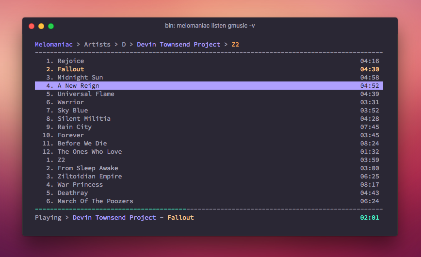

# Melomaniac

Listen to your Google Play Music and Soundcloud library from your terminal.



## Requirements

- Python 3.5+
- mpv

## Installation

```python
pip install melomaniac
```

You will also need to install [mpv](https://mpv.io) to actually play the songs.


## Usage

To launch the player, just do:

```
melomaniac listen gmusic
```

or

```
melomaniac listen soundcloud
```

If this is the first time using a specific backend, Melomaniac will ask you
a few pieces of information:

- **Gmusic**: `username` and `password`. There is no way around it. If you have 2FA activated for you account
you must create an application specific password.
- **Soundcloud**: `client_id`, `client_secret`, `username` and `password`.
You need to [acquire a client credential for your application](http://soundcloud.com/you/apps/new),
in order for Melomaniac to work. Both `username` and `password` will only be used once to retrieve API tokens
and will never be stored.

The configuration is stored in `~/.melomaniac/config.yml`.


### Commands

- Access an element (`right` or `enter`)
- Navigate a list (`up`/`down`)
- Play a song (`enter`)
- Pause/Resume a song (`space`)
- Forward/Rewind (`f`/`r`)
- Quit (`q`)
